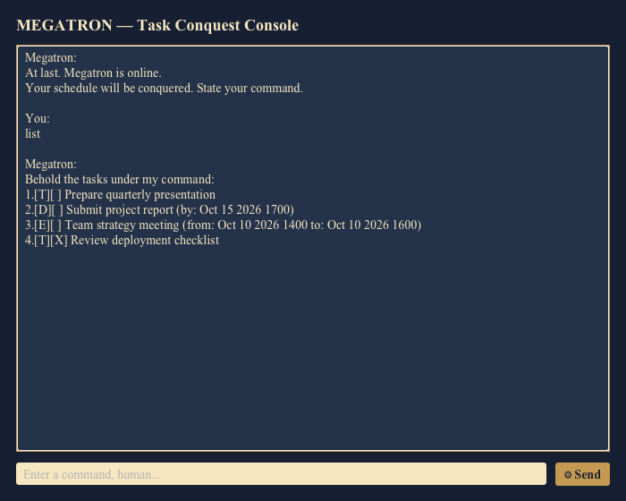

# Megatron

Megatron is a desktop task manager with the personality of an evil Transformer.
It stores tasks locally and responds to commands through a JavaFX GUI or the command line.

## Requirements

- JDK 25
- macOS, Windows, or Linux

## Running Megatron

Run the JavaFX GUI from the project root:

```bash
./gradlew run
```

To build an executable JAR:

```bash
./gradlew shadowJar
java -jar build/libs/megatron.jar
```

Tasks are saved in `data/megatron.txt`.

## Commands

| Command | Example | Purpose |
| --- | --- | --- |
| `todo` | `todo Prepare presentation slides` | Adds a task without a date |
| `deadline` | `deadline Submit report /by 2026-10-15 1700` | Adds a deadline |
| `event` | `event Team meeting /from 2026-10-10 1400 /to 2026-10-10 1600` | Adds an event |
| `list` | `list` | Displays all tasks |
| `find` | `find report` | Searches task descriptions |
| `mark` | `mark 1` | Marks a task complete |
| `unmark` | `unmark 1` | Marks a task incomplete |
| `delete` | `delete 1` | Deletes a task |
| `snooze` | `snooze 2 2026-10-16 1700` | Reschedules a deadline or event |
| `bye` | `bye` | Exits Megatron |

Commands must use one space between parameters. Megatron reports invalid commands,
impossible dates, invalid event ranges, duplicate tasks, and storage problems without crashing.

## Screenshot


